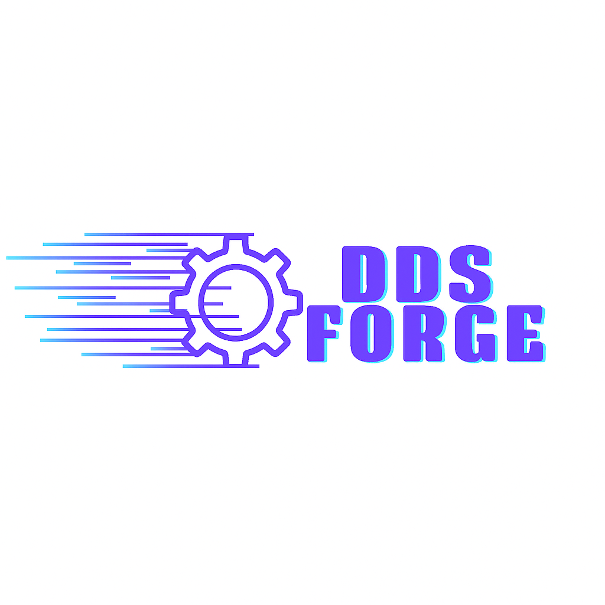

# DDS FORGE

A modern, web-based configuration editor for Data Distribution Service (DDS) implementations. Create, edit, and validate DDS configuration files with an intuitive user interface.



## Features

### Supported Implementations

- **FastDDS** (EProsima Fast DDS) - Complete profile and settings management
- **CycloneDX** (Eclipse CycloneDDS) - Domain and transport
- **Zenoh** - JSON-based runtime configuration

### Core Functionality

- 🚀 **Create from Scratch** - Start with default configurations for any supported DDS vendor or a fresh Zenoh JSON config
- 📦 **Use Default Templates** - Toggle a predefined, vendor-specific template for FastDDS, CycloneDDS, or Zenoh when you don&apos;t want to build the config from a blank file
- 📁 **Import Existing** - Upload and edit existing XML/JSON configuration files, including Zenoh JSON configs
- ✏️ **Visual Editor** - Form-based editing with real-time validation
- 👀 **Live Preview** - Preview generated XML/JSON before downloading
- ✅ **Validation** - Built-in schema validation for all supported formats
- 💾 **Export** - Download your configurations as properly formatted files
- 🔄 **Reset Functionality** - Revert to original or default configurations

### Advanced Features

- **Split-screen Interface** - Efficient editing with two-column layout
- **Drag & Drop Upload** - Easy file import with visual feedback
- **Real-time Validation** - Immediate feedback on configuration errors
- **Modified Field Highlighting** - Visual indicators for changed values
- **Minimal Output Mode** - Export only non-default values for cleaner configs

## Getting Started

### Prerequisites

- Node.js 18+
- npm or yarn

### Installation

1. Install dependencies:

```bash
npm install
```

2. Start the development server:

```bash
npm run dev
```

3. Open your browser to `http://localhost:5173`

### Building for Production

```bash
npm run build
```

The built files will be in the `dist` directory.

## Usage

### Creating a New Configuration

1. Choose your target system (FastDDS, CycloneDDS, or Zenoh)
2. (Optional) Enable the `Use default template` toggle to start from a predefined config instead of an empty one
3. Fill in the configuration parameters using the form interface
4. Preview your configuration to ensure it's correct
5. Download the generated XML/JSON file (including Zenoh JSON when applicable)

### Editing an Existing Configuration

1. Click "Upload Existing Configuration"
2. Drag and drop your XML/JSON file or click to browse (supports DDS XML and Zenoh JSON)
3. Edit the loaded configuration using the visual form
4. Preview and download your updated configuration

### Configuration Validation

- Real-time validation as you type
- Schema-based validation for all supported DDS vendors
- Clear error messages and guidance
- Preview mode with validation results

## Project Structure

```
src/
├── components/          # React components
│   ├── ui/             # Reusable UI components (Radix UI)
│   ├── FastDDSProfileEditor.tsx
│   ├── FastDDSProfileCreator.tsx
│   ├── FormField.tsx
│   ├── FileUpload.tsx
│   └── ...
├── schemas/            # DDS schema definitions
│   ├── fastdds-schema.ts
│   ├── cyclonedds-schema.ts
├── utils/              # Utility functions
│   ├── xmlParser.ts    # XML parsing and generation
│   ├── jsonParser.ts   # JSON parsing for Zenoh
│   ├── xmlValidator.ts # Validation logic
│   └── ...
├── types/              # TypeScript type definitions
└── App.tsx            # Main application component
```

## Technology Stack

- **Frontend Framework**: React 19 with TypeScript
- **Build Tool**: Vite
- **Styling**: Tailwind CSS
- **UI Components**: Radix UI primitives
- **XML Processing**: fast-xml-parser
- **File Handling**: react-dropzone
- **Icons**: Lucide React

## Development

### Available Scripts

- `npm run dev` - Start development server
- `npm run build` - Build for production
- `npm run preview` - Preview production build
- `npm run lint` - Run ESLint

### Code Style

This project uses ESLint with TypeScript rules for code quality and consistency.

## Supported File Formats

### FastDDS

- **Input**: XML files with `<dds>` root element
- **Output**: FastDDS-compatible XML configuration

### CycloneDDS

- **Input**: XML files with `<CycloneDDS>` or `<cyclonedds>` root element
- **Output**: CycloneDDS-compatible XML configuration

### Zenoh

- **Input**: JSON configuration files following Zenoh config structure
- **Output**: Validated and updated Zenoh JSON configuration

## Contributing

1. Fork the repository
2. Create a feature branch (`git checkout -b feature/amazing-feature`)
3. Commit your changes (`git commit -m 'Add some amazing feature'`)
4. Push to the branch (`git push origin feature/amazing-feature`)
5. Open a Pull Request

## License

This project is proprietary software.

## About

Developed by [EightVectors](https://www.eightvectors.com/) - Specialists in DDS and real-time communication systems.

---

**Copyright © 2025 EightVectors. All rights reserved.**
