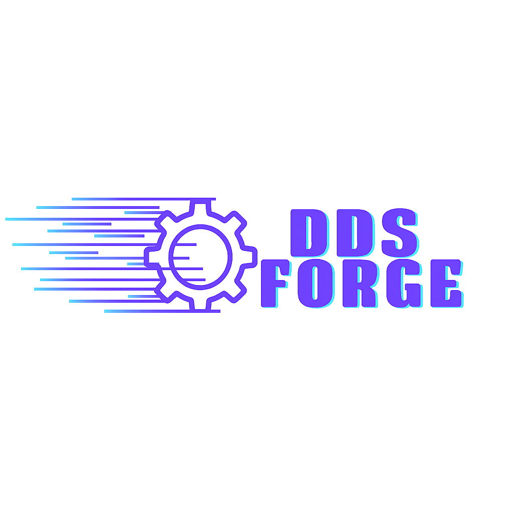

# DDS Forge

**🌐 Live Application:** [https://ddsforge.zenita.ai/](https://ddsforge.zenita.ai/)

A modern, web-based configuration editor for Data Distribution Service (DDS) implementations. Create, edit, and validate DDS configuration files with an intuitive interface. Runs entirely in your browser; no data leaves your device.



---

## About

DDS Forge is a free, browser-based DDS XML configuration generator and editor for CycloneDDS and Fast DDS. It supports both vendor formats and never stores or uploads your files.

---

## Quick Start (in the browser)

1. Create: Choose CycloneDDS or Fast DDS.
2. Upload or Import: Drag & Drop an existing XML (full or partial); it will be parsed into editable sections.
3. Configure: Adjust profiles, domains, transport settings, logs, and more visually.
4. Preview XML: Preview your vendor-compliant file. Optionally enable "Minimal output (non-defaults only)" to show only changed values.
5. Download XML: Set a filename and download.

---

## Features

- No Install, No Login, No Storage (files stay local)
- Vendor Neutral: switch between CycloneDDS and Fast DDS
- Create from scratch or import existing XML/JSON
- Visual editor with real-time validation
- Live preview and Minimal Output Mode
- Split-screen interface
- Drag & Drop upload with visual feedback
- Modified field highlighting
- Works offline after first load (PWA-capable)

### Supported DDS Implementations

- Fast DDS (eProsima) — complete profile and settings management
- CycloneDDS (Eclipse) — domain and transport

---

## Tips

- Use Reset to start fresh without reloading the page.
- Keep XML naming conventions consistent for topics and profiles.
- Download when done — there is no auto‑save.
- Works offline after the first load.

---

## Limitations

- Currently supports CycloneDDS and Fast DDS only.
- No validation for vendor-specific extensions outside supported schema.
- No simulation or live DDS connectivity.

---

## Support & Feedback

- **GitHub Discussions**: [https://github.com/Eight-Vectors/ddsforge/discussions](https://github.com/Eight-Vectors/ddsforge/discussions)

---

## Development

### Prerequisites

- Node.js 18+
- npm or yarn

### Installation

```bash
npm install
```

### Start the development server

```bash
npm run dev
```

Open `http://localhost:5173`

### Building for Production

```bash
npm run build
```

Output is in `dist/`.

### Available Scripts

- `npm run dev` — Start development server
- `npm run build` — Build for production
- `npm run preview` — Preview production build
- `npm run lint` — Run ESLint

### Project Structure

```
src/
├── components/          # React components
│   ├── ui/              # Reusable UI components (Radix UI)
│   ├── FastDDSProfileEditor.tsx
│   ├── FastDDSProfileCreator.tsx
│   ├── FormField.tsx
│   ├── FileUpload.tsx
│   └── ...
├── schemas/             # DDS schema definitions
│   ├── fastdds-schema.ts
│   ├── cyclonedds-schema.ts
├── utils/               # Utility functions
│   ├── xmlParser.ts     # XML parsing and generation
│   ├── jsonParser.ts    # JSON parsing for Zenoh
│   ├── xmlValidator.ts  # Validation logic
│   └── ...
├── types/               # TypeScript type definitions
└── App.tsx              # Main application component
```

### Technology Stack

- Frontend Framework: React 19 with TypeScript
- Build Tool: Vite
- Styling: Tailwind CSS
- UI Components: Radix UI primitives
- XML Processing: fast-xml-parser
- File Handling: react-dropzone
- Icons: Lucide React

### Supported File Formats

- FastDDS
  - Input: XML files with `<dds>` root element
  - Output: FastDDS‑compatible XML configuration

- CycloneDDS
  - Input: XML files with `<CycloneDDS>` or `<cyclonedds>` root element
  - Output: CycloneDDS‑compatible XML configuration

---

## License

MIT License — see `LICENSE` for details.

## About

Developed by [EightVectors](https://www.eightvectors.com/) — Specialists in DDS and real‑time communication systems.

---

**Copyright © 2025 EightVectors.**
